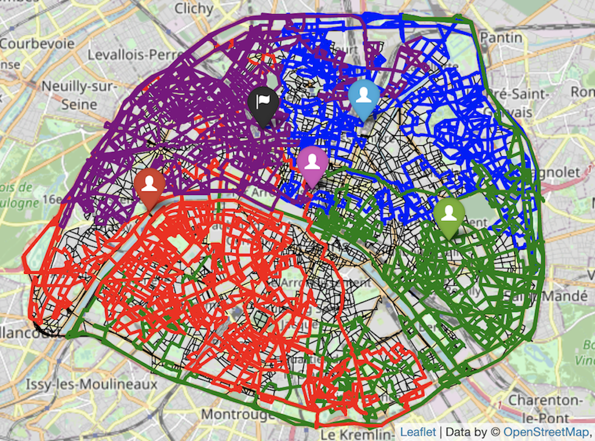

```@meta
CurrentModule = Julia_Hashcode2014
```

<!--
<script
  src="https://cdn.mathjax.org/mathjax/latest/MathJax.js?config=TeX-AMS-MML_HTMLorMML"
  type="text/javascript">
</script>
-->


# Algorithms in Julia_Hashcode2014

Documentation for the algorithms in [Julia_Hashcode2014](https://github.com/davidfang00/Julia_Hashcode2014.jl).

This document outlines many separate algorithms that each described with performance in mind. It is then followed by the most optimal solution at the end of the document that incorporates all the separate algorithms together into one complete algorithm.

## Greedy

The greedy approach is the one of the simplest approaches to implement that yields fairly sufficient results. In short, the greedy approach entails cars taking turns going down one street at a time and at each junction, the cars will determine the next street to take based off the following criteria:

- Inspect all outgoing neighboring junctions. Out of the ones that are unvisited, the car will choose to go the junction where there is a maximum distance between its current junction and the next (while still obeying the time constraints).

- If all outgoing neighbors have been visited, the car will choose a random junction to go to (while still obeying the time constraints). 

Greedy algorithms are designed for speed. Although the solution might not actually be the most optimal, we can be certain that at least the algorithm will be quick. For each car at each junction, the car must only look at its outgoing neighbors to make its next decision so its time complexity for each time step is O(V) where V is the number of vertices or junctions. This is certainly quite fast, considering there are usually not that many outgoing neighbors for each junction. 

Additionally, at each time/decision step for each car, we need to make a data structure of size O(V) for all the outgoing neighbors to see which candidate would be optimal to take. Thus, this requires an O(V) space complexity for each time step for each car, but considering that there usually are not that many outgoing neighbors at each junction, this is really not that bad.

The algorithm takes 1-2 seconds and achieves approximately 1.1-1.25 million meters traveled under the 54000 second time constraint.

## Greedy Lookahead

A simple greedy algorithm can be better optimized with the addition of a lookahead approach. Under the lookahead approach, instead of the cars simply choosing the immediate street that offers the longest distance at each junction stop, the cars will now look at various paths from the current junction that contain the next 15 streets in sequence with the goal that that this path of 15 streets will be the longest distance covered in within the 15 timestamps. Thus, for each car, the greedy lookahead approach still uses a distance metric and utilizes BFS of 15 levels in order to find the most optimal path to take at a current junction.

Like before, we want to avoid taking visited streets as much as possible in order to increase coverage so BFS first looks through candidates of outgoing neighboring junctions to take that are unvisited. However, if all outgoing streets for a current junction lead to outgoing neighboring junctions have been visited, then a random candidate is chosen.

This algorithm will inherently be slower than a simple greedy algorithm and take more space as well. For each car, when it is ready to plan a path for the next 15 timestamps (getting ready to start a lookahead), it must first create a BFS tree from its current junction, which would be O(V) space complexity where V represents vertices or junctions. Traversing the BFS tree is also necessary to find an optimal path based on a distance metric so this would require O(V^15) time complexity to plan out a path for the next 15 steps (for the 15 levels of the BFS tree). Therefore, at the start of every 15 timestamps (beginning of lookahead), each car will have O(V^15) time complexity and O(V) space complexity.

Originally, we ran into efficiency and memory problems with our first BFS approach because we stored each possible path and their visited streets set into a list of lists. This consumed a lot of memory and was highly inefficient because we didn't need to store every possible path. To overcome this, we created a tree structure, which only stored nodes that should be tracked, and the paths could be retrieved by backtracking. This led to a speedup of around 2-3x compared to the first implementation.

This algorithm greatly increases the score, but makes a tradeoff in performance: the algorithm achieves 1.3-1.45 million meters traveled, but requires 20 seconds to run to completion. We are willing to make this tradeoff due to the needed increase in score.


## Greedy Lookahead+Fandown

This approach uses a fandown method that is then followed by a greedy lookahead approach. The rationale behind utilizing the fandown method stems from the fact that the headquarters is not located in the center of the map (it is in the upper left corner). Having a greedy lookahead approach start for the cars with this original starting point would not be ideal in terms of coverage because the cars would be disproportionately traversing the upper left corner area. 

Thus, the objective behind “fanning down” then is to initially move the cars down so that their starting positions can be closer to the center of the map. When greedy lookahead is then applied after, the coverage of the car paths will cover the map more evenly, due to a more central starting position. 

In order to fandown the cars, at each junction the cars will look at the outgoing neighbors and choose to go to the one that traverses in the south direction as much as possible (biggest difference in latitude values). However, we don’t want all the cars to take the same path down in the fandown process as this is wasted time that could be used to explore other streets. 

As a result, we still want the cars to take streets that lead them south near the center of the map, but we want to probabilistically have them take different streets at each junction. During the fandown process, at each junction the car must traverse a street that has not been visited before with a probability of 1/diff\_rand, where diff\_rand is a variable that can be fine-tuned. The default value of diff\_rand is 5 so at each junction, there is ⅕ probability that the car must choose a street not visited before but has the next highest distance traveled south. 

The remaining algorithm after the fandown process completes follows the protocol of the greedy lookahead approach with no further changes.

The fandown process is quite efficient and does not add much extra space. The fandown process runs for a predetermined number of iterations (100 is the default value) and runs for a predetermined number of cars (4 cars if total number of cars is 8). At each time step, each car must look only at its outgoing neighbors, which is a time complexity of O(V). Again, we only add O(V) space complexity at each time/decision step for each car but this is marginal considering most junctions have few outgoing neighbors.

The greedy+fandown approach increases in score slightly, but decreases time by ~25%: this algorithm yields a score of 1.35-1.47 million meters and runs for 15 seconds.

## Dijkstras

Rather than probabilistically sending cars down to a certain location at the start, another approach would be to determine set locations that we want to send cars to and do so in the most optimal way. In short, we want to increase coverage as much as possible by sending cars to explore all sides and areas as much as possible. Thus, this approach entails first finding 4 junctions : one at the largest latitude, one at the lowest latitude, one at the largest longitude, and one at the lowest longitude. The rationale is to move the cars in these positions so that they start in areas that cover the north, east, south, and west sections. 

Once the 4 junctions have been found that sends them into the north, east, south, and west positions, Dijkstra's algorithm is used to send 4 cars to these positions in the shortest amount of time. 

With the priority queue using Julia's DataStructure package to improve efficiency, Dijkstra's algorithm runs in O((E + V) log(V)). Additionally, we are only running Dijkstra's for the first 4 cars, so it is not such a huge hit on performance.

This algorithm does not run on its own and is used in addition to the next algorithm discussed that combines all algorithms together (Greedy Lookahead+Dijkstras+Fandown).


*Dijkstra's is used to send the first 4 cars to the NESW points*

## Greedy Lookahead+Dijkstra+Fandown

This algorithm is a combination of the greedy lookahead, Dijkstra's, and fandown approach. To begin, the first 4 cars are sent in the north, east, south, and west positions using Dijkstra's. It is not necessary to send the cars all the way to the very ends/boundary of the map during this process so we stop the cars ~85% of the way during their respective Dijkstra's paths. 

Next, the other remaining cars will fandown into a lower position of the map. At this point all cars have properly moved into their new starting positions and are ready to explore using the greedy lookahead approach.

However, we have modified the greedy lookahead approach to also take into account boundaries of sections we want each car to explore. In order to ensure we are increasing coverage as much as possible, we want to discourage cars from exploring areas that other cars are already traversing. In order to do so, we first split the map into 4 sections: upper-right, lower-right, lower-left, and upper-left quadrants. Each of the first 4 cars will be assigned to the above sections respectively in that order, where the section bounds are the halfway mark between the maximum and minimum latitude and the halfway mark between the maximum and minimum longitude. 


*The 4 bounded quadrants that the first 4 cars will explore*

For the remaining 4 cars, they will explore sections with slightly different boundaries. The 5th car will explore the upper half of the map (anything above the mid-value latitude), the 6th car will explore the right half of the map (anything above the mid-value longitude), the 7th car will explore the bottom half of the map (anything below the mid-value latitude), and the 8th car will explore the left half of the map (anything below the mid-value longitude). 

Of course, this setup is ideal if we have 8 cars, but if we have less we simply assign the cars to the sections mentioned in the respective order until we run out of cars: upper-right, lower-right, lower-left, upper-left, upper-half, right-half, bottom-half, and finally left-half.

At this point, we have cars in strategic starting positions: 4 near the perimeter (located in the north, east, south, and west) and 4 near the center that are randomly slightly spaced out. The next step is to run greedy lookahead on the cars.

The greedy lookahead works similar to the one mentioned above except that we use BFS with a speed metric instead of a distance metric. Additionally, to ensure that the cars are traversing in their respective sections without crossing bounds, if a street leads a car to a junction that crosses its respective section’s boundary, a discount factor is applied to the perceived distance so that the speed appears to be lower in the BFS tree and that street is less likely to get chosen. Again, we also choose unvisited streets first before visited ones. 

An interesting artifact that results from the greedy lookahead approach is that sometimes duplicate street paths are taken. For example, let’s say there are junctions 1 and 2. With the algorithm, a car might hypothetically have the following path: [1, 2, 1, 2, 4, 5 ,6...]. Obviously, going from 1 to 2 back to 1 to 2 again is wasted time. As a result, once greedy-lookahead is applied, we inspect to see what duplicates exist and we remove them. We then add back time that was wasted from the duplicates and run the greedy lookahead again with the remaining time that is left.

This is the ideal solution that runs in 20 seconds and achieves a score of 1.65-1.8 million. It's no surprise that time is around the same as the previous solutions discussed because time complexity has already been explained in previous sections and no further additions would exceedingly add to this time complexity. Additionally, no other space complexity is added due to the only other significant data structures being added outside of the adjacency matrix were the lookahead trees (BFS trees), which has already been discussed.

## Upper Bound of Solution

The way we went about determining the upper bound of the total distance of any feasible solution is by first sorting the list of edges (roads) by distance/time. After forming an ordered list of the roads that could be traversed from largest $(\frac{\text{distance}}{\text{time}})$ value to the smallest, we thought the best approach to come up with an upper bound would be to simulate sending 1 of the $n$ cars down each road in order, one at a time. To optimize the solution, we looked at each car independently such that time could be taken into account independently for each car (if one car starts down a road, that does not mean the time limit has started for all of the other cars as well). With these restrictions set in place, having cars traversing the same road multiple times and wasting time was no longer a problem (which would be the optimal algorithm). 

As such, let us say that we have $n$ cars (each car labeled $n_i$), and $r$ roads (each road labeled $r_i$) each with their own respective distance $d_i$ and time $t_i$. Let us also acknowledge that the time constraint for all the cars is $T$, now we can determine our upper bound given the restrictions/approach above. If each $n_i$ car is independently restricted by $T$, we can iterate through our sorted list of roads and allow car $n_i$ travers the roads in order while keeping track of accumulated time and distance. After car $n_i$ completely traverses a road, we will remove the road from our list so that it isn’t traversed multiple times. There are a couple of edge cases where car $n_i$ is closing in on having an accumulated time near $T$ and the next road's time constraint (in the list order) is greater than $T - \text{(current accumulated time of car )} n_i$. If this is the case, we can loop through all of the remaining roads to find a road that takes $t_i \leq T - \text{(current accumulated time of car )} n_i$, and have $n_i$ traverse that road instead until the $\text{(current accumulated time of car )} n_i = T$ or there is no road with  $t_i <= T - \text{(current accumulated time of car )} n_i$. Since the first iteration with car $n_1$ has the option to pick from any of the $r_i$ roads, we can upper bound its total distance by whatever subset of $r$ roads is closest to $T$ while traversing the list in order from largest $(d_i/t_i)$, which we can say is some subset of the roads called $M$. Since $n_1$ has the most diverse number of options of roads and times to choose from, we know that $M$ must be close to the optimal subset that is closest to $T$, thus making it an upper bound. 

As such, the overall upper bound of our approach to determine the total distance of any feasible solution is $M * \text{(the number of cars available)} \rightarrow M$ in this case is the subset accounted for at the end of each $n_i$’s complete iteration through the list of ordered roads. 
